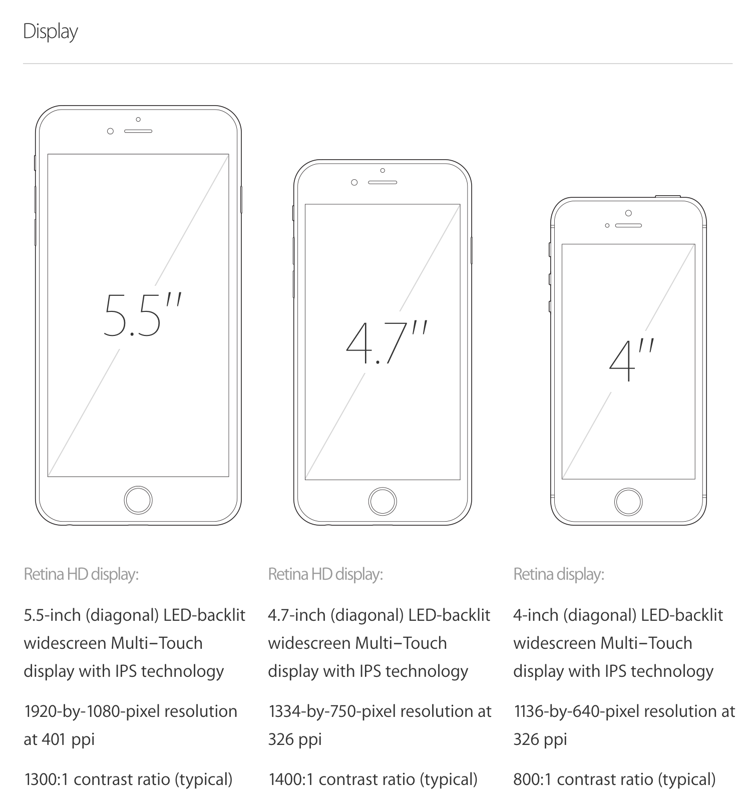
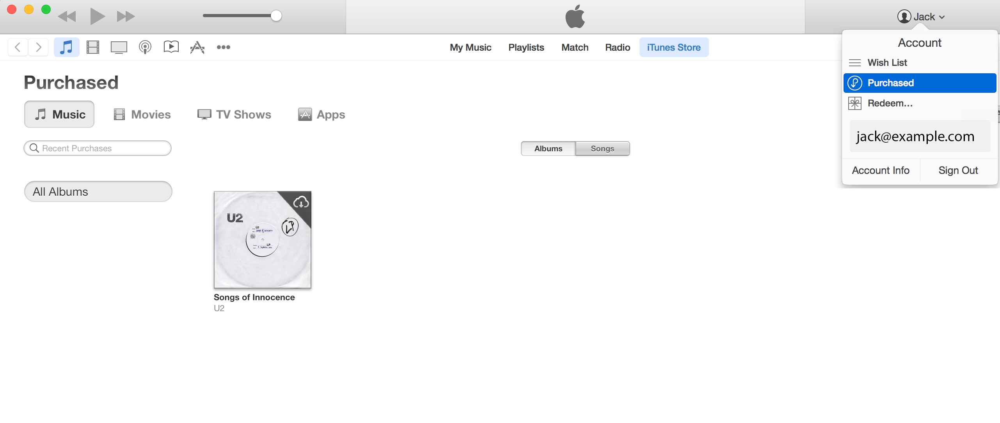

# [FIT] Melbourne Cocoaheads #76
#### 11 September 2014

---

# [FIT] The month that was

^ August 15 - September 11 2014
^ Presented by Jack Barker jack.barker.au@gmail.com

---

# [FIT] tmtw; tldr

---

# tldr;
- September 9 announcements:
 - iPhone 6
 - iPhone 6+
 - apple watch
 - apple pay
 - U2 album giveaway
- Implications for app development

---

# tldr (cont');
- Live stream "issues" (?)
- Macworld downsizing

---

# [fit] 9.9.2014

---

# [fit] Live Stream Event
- "Wish we coud say more."
- Slack ( melbournecocoa.slack.com )
- Live stream issues?

---

# [fit] New Devices

---

# [fit] iPhone 6

---

---

# [fit] AppleWatch

---

- 3 Models
 - **Original**
 - **Sport** (improved durability)
 - **Legend** (gold plated. literally.)
- Requires iPhone
- From $349 (USD)
- "Early 2015"

---

# [fit] New UX Paradigm

---

- Tap vs. Press
- Crown to zoom
- Quick reponses

---

# [fit] ApplePay

---

---

# [fit] U2 Album Launch

---

---

# [fit] Macworld

---

---

# Key Dates

- Sep 12: Preorder date for iPhone 6 / 6+
- Sep 17: iOS 8
- Sep 19: "Ship date" for iPhone 6 / 6+ (inc. Aust)
- XXX XX: Xcode 6 to leave beta
- Oct XX: ApplePay launch date (US)
- Oct XX: U2 album giveaway ends
- Early 2015: apple watch becomes available

---

# H1
## H2

- Some [stuff][1] 1
- Some [other stuff][2] 2

---

<!-- Markdown style reference -->
[1]: http://www.melbournecocoaheads.com/ "stuff"
[2]: http://www.melbournecocoaheads.com/about/ "other stuff"

<!-- Appears Markdown style references are unsupported by Deckset at this time -->
(1) http://www.melbournecocoaheads.com/
(2) http://www.melbournecocoaheads.com/about/

---

# [fit] </tmtw>